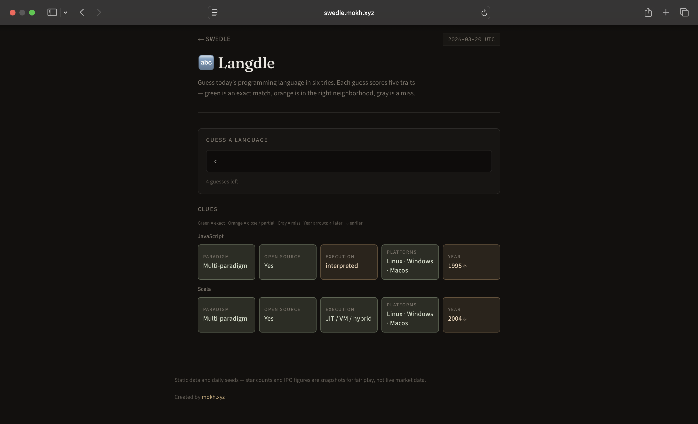

# SWEDLE

Daily mini-games for software engineers. A new puzzle set every **UTC calendar day**—no accounts; progress and scores live in the browser (`localStorage`).

**Play online:** [swedle.mokh.xyz](https://swedle.mokh.xyz/)



## Games

| Game | What you do |
|------|----------------|
| **Langdle** | Guess the programming language in six tries. Five clues per guess (paradigm, open source, execution model, platforms, year) with Wordle-style feedback—green exact, orange close, gray miss; year hints with ↑ / ↓. Share grid via **Copy text** or **Post on X** ([react-share](https://github.com/nygardk/react-share)). |
| **Star Battle** | Five rounds in a **chain**: the factual winner stays on the **left**, a new repo challenges from the right. Pick who has more GitHub stars (fixed snapshot data). |
| **IPO Showdown** | Same chain mechanic for companies—higher opening valuation or earlier IPO per round (rough figures, not live data). |
| **Big‑O Blitz** | Five multiple-choice complexity questions. |
| **Chrono Commit** | Which tech event happened first—winner stays left, new event on the right. |

Quiz games (everything except Langdle) show a richer **end screen** when you finish the run. **Progress** (current round, Langdle guess rows, finished state) is restored after refresh for the same UTC day.

## Tech stack

- **Next.js 16** (App Router), **React 19**, **TypeScript**
- **Tailwind CSS v4**
- **Framer Motion** (transitions / comparisons)
- **react-share** (`XShareButton` for X.com intent URLs)

Server actions validate picks where answers must stay server-side; daily puzzles are **deterministic** from the date string + seeded PRNG (`lib/seed.ts`).

**Community stats (optional):** [Firebase Admin](https://firebase.google.com/docs/admin/setup) + **Firestore** store per-day solver counts and score histograms. End screens show how many people finished today, an approximate “better than X%” line (quiz: higher score wins; Langdle: fewer guesses wins), and a small distribution chart. Only the **server** talks to Firestore (`firebase-admin`); configure via `.env.example`. If Firebase env is unset, those UI blocks stay hidden.

## Run locally

```bash
npm install
npm run dev
```

Open [http://localhost:3000](http://localhost:3000). Production: [https://swedle.mokh.xyz/](https://swedle.mokh.xyz/).

```bash
npm run build   # production build
npm run start   # run production server
npm run lint    # ESLint
```

## Project layout

```
app/           # Routes: /, /lang, /stars, /ipo, /complexity, /timeline
components/    # UI (games, GameShell, GameEndScreen, LangShareButton, …)
data/          # JSON datasets (languages, repos, IPOs, timeline, complexity)
hooks/         # usePersistedQuiz
lib/           # seed, daily UTC key, game logic, scores, persistence
```

`app/layout.tsx` sets `dynamic = "force-dynamic"` so “today” is resolved per request (UTC).

## Data disclaimer

Repo star counts, IPO ballpark numbers, and timeline years are **curated snapshots** for fair, repeatable dailies—not live market or GitHub data.

## Deploy

Any Node host that supports Next works (e.g. [Vercel](https://vercel.com/docs/frameworks/nextjs)).

**Optional env:** `NEXT_PUBLIC_SITE_URL` — overrides the default production origin (`https://swedle.mokh.xyz`) for canonical URLs, `sitemap.xml`, and Open Graph/Twitter `metadataBase`. On **Vercel preview** deployments, the preview hostname is used automatically so links stay on the preview.

**Firebase (community stats)** uses Firestore collection `dailyStats`, doc IDs `{UTC-date}_{game}`. The **server** uses `firebase-admin` only (no client SDK).

### Activate on Cloud Run (recommended: no JSON in env)

1. **One Google Cloud project**  
   In [Firebase Console](https://console.firebase.google.com/), your app should use the **same** GCP project you deploy Cloud Run to (Firebase → Project settings → “Google Cloud” should show that project).

2. **Turn on Firestore**  
   Firebase Console → **Build → Firestore Database** → create database (Native mode, any region). Rules can deny all client access; the Admin SDK bypasses rules.

3. **Let Cloud Run talk to Firestore**  
   Cloud Run uses a **service account** (Revision details → **Security** → “Service account”, often `PROJECT_NUMBER-compute@developer.gserviceaccount.com` unless you changed it).  
   In [GCP IAM](https://console.cloud.google.com/iam-admin/iam), grant that account **`Cloud Datastore User`** (`roles/datastore.user`) on **this project** (read/write Firestore).

4. **Deploy**  
   Cloud Run usually injects **`GOOGLE_CLOUD_PROJECT`** and **`K_SERVICE`**. This app turns stats on when it sees a **GCP runtime** (`K_SERVICE`, **`K_REVISION`**, or **`CLOUD_RUN_JOB`**) **and** a project id from **`GOOGLE_CLOUD_PROJECT`**, **`GCLOUD_PROJECT`**, or **`FIREBASE_PROJECT_ID`**.  
   If the end screen shows **Community stats** with a hint about a missing project, **add `GOOGLE_CLOUD_PROJECT` yourself** under Cloud Run → your service → **Edit & deploy new revision** → **Variables** (value = your GCP project id, e.g. `my-prod-123`). Some Next.js / Docker setups don’t see the platform default.  
   If it still doesn’t enable, set **`FIREBASE_STATS_ENABLED=1`** and **`GOOGLE_CLOUD_PROJECT`** (or **`FIREBASE_PROJECT_ID`**) together to force ADC.  
   If your **Firebase project id** ≠ GCP project id, set **`FIREBASE_PROJECT_ID`** to the Firebase id.

5. **Check**  
   Finish a game: the **Community stats** block should show solvers or a short **troubleshooting message** (not a blank gap). In Firestore, collection **`dailyStats`** should get docs like `2025-03-20_stars`.  
   Optional: set **`SWEDLE_STATS_LOG=1`** on Cloud Run and grep logs for **`[swedle:stats]`** (includes one-time `console.warn` if env isn’t right).

### Other hosts (or if you prefer a key file)

- **`FIREBASE_SERVICE_ACCOUNT_KEY`**: minified JSON of a Firebase **service account** key (local `.env.local` or Secret Manager → env var).  
- **`GOOGLE_APPLICATION_CREDENTIALS`**: path inside the container to that JSON file (e.g. secret mounted as a file).  
- Non–Cloud Run GCP: you can set **`FIREBASE_USE_ADC=1`** plus project id so ADC is used explicitly.  

See `.env.example`.

**Debugging:** With `npm run dev`, server logs prefixed `[swedle:stats]` show init, each `getDailyStats` read, and `recordDailyCompletion` / Firestore writes. For production builds, set `SWEDLE_STATS_LOG=1` to enable the same logs.
